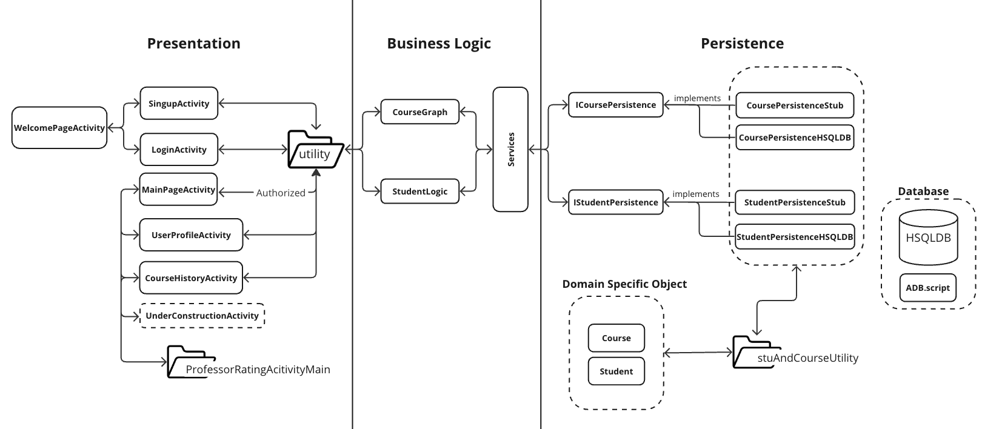
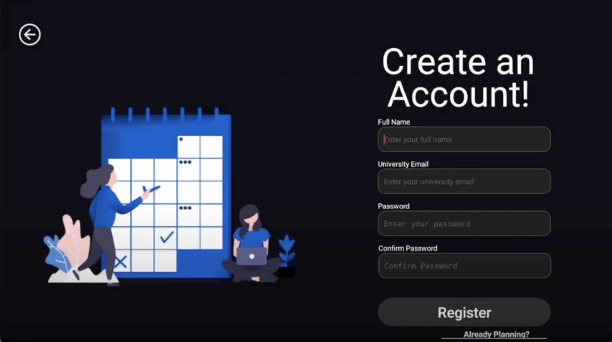
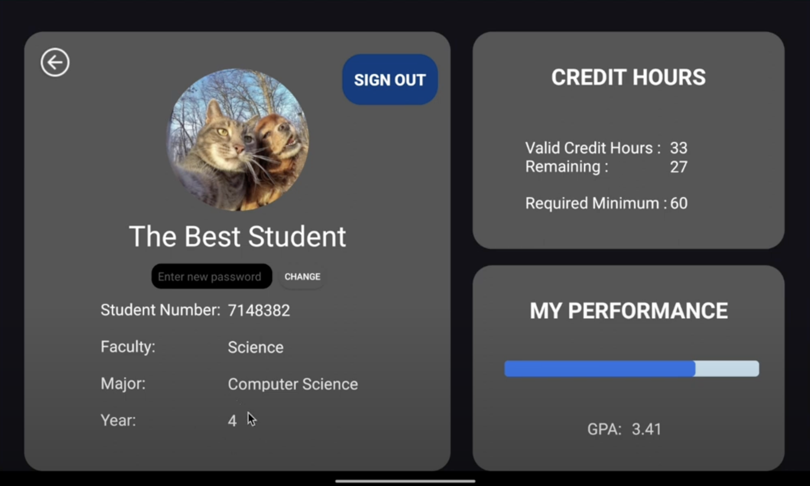
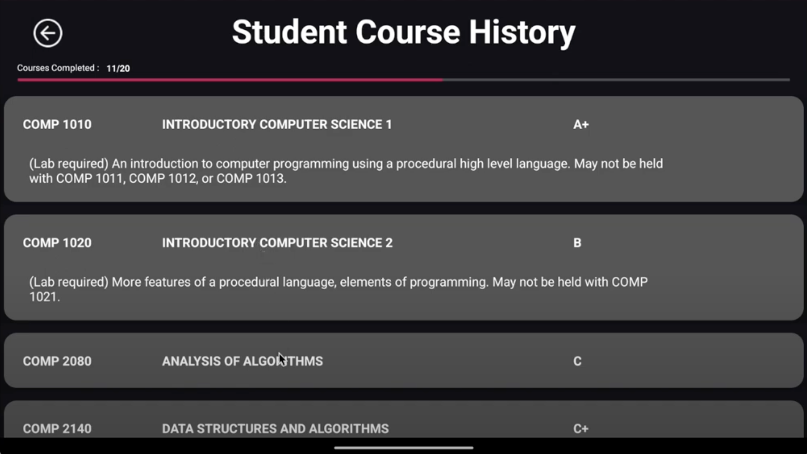
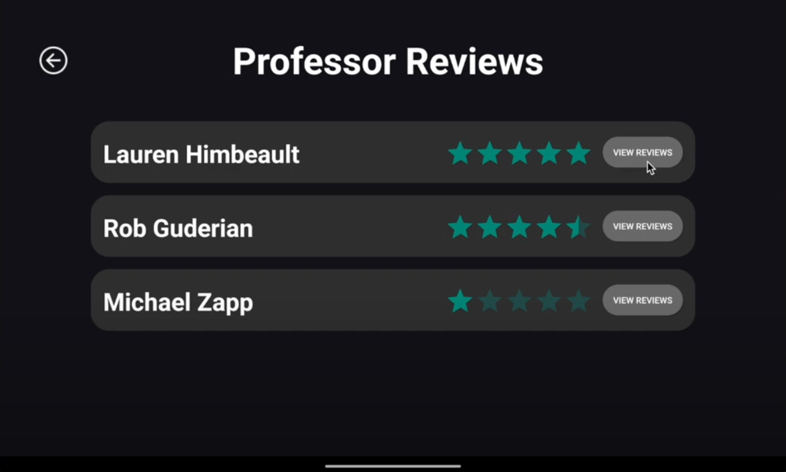
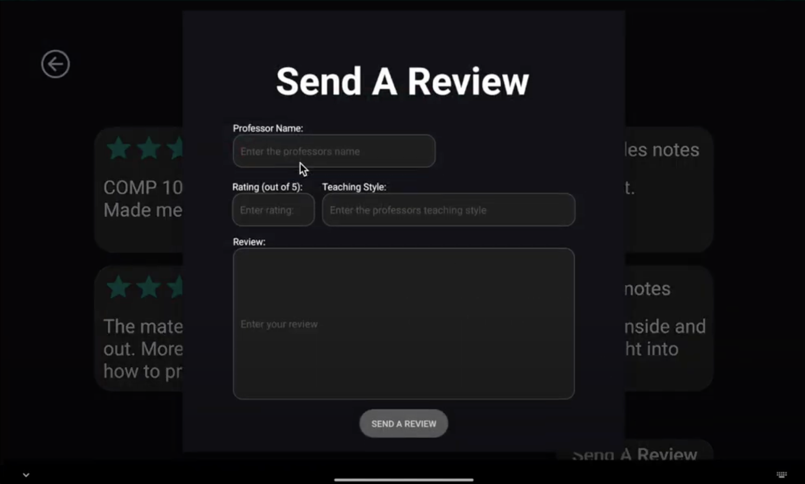

# UPlanner (Project Documentation)

## Login Using
- Email: user@myumanitoba.ca
- Password: 12345678
- Or sign up with an email ending with @myumanitoba.ca

## Overview and Usage (App screenshots at bottom)
UPlanner is an Android application that simplifies degree and course planning for university students. It offers features like:
1. **Sign up and log in**
   - Create a new account or log in with an existing account.
2. **Display and update profile information**
   - View and update personal information like GPA, major, etc.
3. **View course history**
   - See all taken courses and their grades.
   - View course descriptions and progress towards graduation.
4. **View and post professor ratings**
   - View and post reviews of professors.

## Architecture


### Demonstration Video:
- [YouTube Video](https://www.youtube.com/watch?v=8TsD6c_cBf8)

## Prerequisites and Planning Logic 
We use an adjacency matrix to construct a directed graph (digraph) representing course prerequisite relations. This helps in calculating required and completed courses.

### Adjacency Matrix Example

Consider the following courses and their prerequisites:
- COMP 1010 and COMP 1020 are prerequisites for COMP 2140.

```python
         COMP 1010  COMP 1020  COMP 2140
COMP 1010     0          0          1
COMP 1020     0          0          1
COMP 2140     0          0          0
```

In this matrix:
- The cell at (COMP 1010, COMP 2140) has a `1`, indicating COMP 1010 is a prerequisite for COMP 2140.
- The cell at (COMP 1020, COMP 2140) has a `1`, indicating COMP 1020 is a prerequisite for COMP 2140.

This adjacency matrix allows us to effectively manage and visualize course prerequisite relations and progress tracking.
   
## Installation

To install the application:

1. **Clone the repository**:
   ```bash
   git clone https://github.com/yourusername/yourrepository.git
   cd yourrepository
   ```

2. **Build the APK**:
   - Open the project in Android Studio.
   - Build the APK file by selecting `Build > Build Bundle(s) / APK(s) > Build APK(s)`.

3. **Install the APK**:
   - Transfer the generated APK file to your Android device.
   - Open the APK file on your Android device to install the application.


## Development
UPlanner follows the GitHub Flow branching strategy:
- **Main Branch**: Represents the production-ready version.
- **Feature Branches**: Created off the main branch for new features or enhancements, e.g., `feature1-GUI` for sign-up and log-in features.
- Short-lived branches are used for specific tasks, e.g., `iteration1` for backend tasks and `iteration1f` for frontend tasks.

# Future Improvements
### Future Iterations and Features
#### Haven't started:
- Feature 5
- Feature 6
- Feature 7
- Feature 9

#### Started, but not finished:
- Plan my degree
- Link logic to UI
- Feature 4

### User Stories for the Future
- Course Suggestion
- Organize available classes based on user's schedule
- Get support for general questions
- Book an appointment with an academic advisor
- See conversation history
- Financial support resources for students
- Degree estimated tuition
- View expected course load
- View course materials and difficulty level
- Share previous course experiences and material
- Potential future job suggestion
- Co-op program information support


## Get Started


## Login and Signup



## Landing Page


## Profile


## Course History


## Professor Reviews


## Post Review


## To be Implemented

